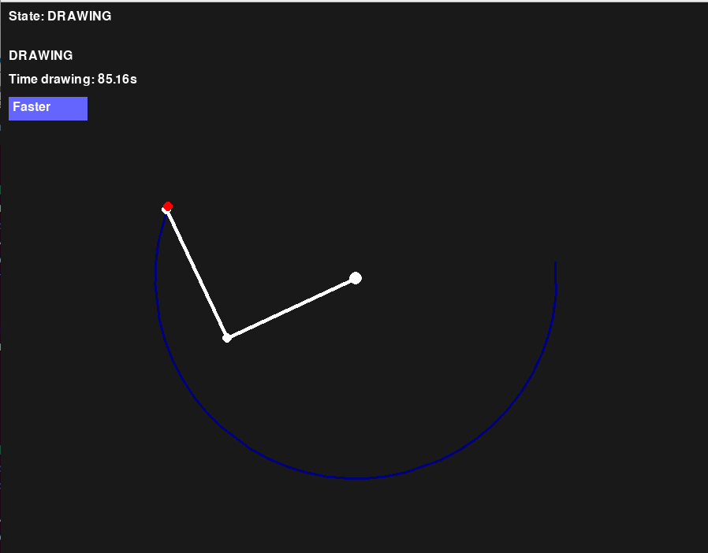
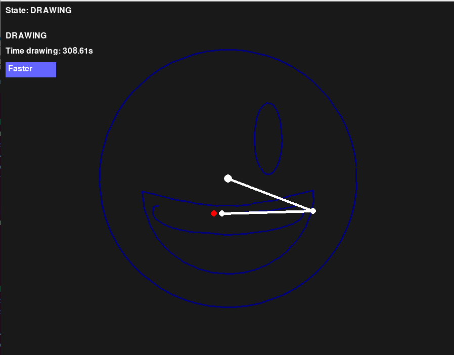

# SCARA-drawing-robot
## Define the path
```bash
make run_segment_extractor
```
Upload an image, set the parameters, extract the path points and download the `segments.json`.

## Activate the robot
Run the script:
```bash
make run_drawing FILE=segments.json
```




Enjoy!


## Kinematics derivation

Here we define the mathematic formulation of a RRT Scara robot with arm sizes $a_1$ and $a_2$. The transformation matrix is defined by the matrix composition:

$M(q_1, q_2, q_3) = R_z(q_1)T_x(a_1)R_z(q_2)T_x(a_2)T_z(q_3)$

$$M(q_1, q_2, q_3) = \left[\begin{matrix}\cos{\left(q_{1} + q_{2} \right)} & \sin{\left(q_{1} + q_{2} \right)} & 0 & a_{1} \cos{\left(q_{1} \right)} + a_{2} \cos{\left(q_{1} + q_{2} \right)}\\- \sin{\left(q_{1} + q_{2} \right)} & \cos{\left(q_{1} + q_{2} \right)} & 0 & - a_{1} \sin{\left(q_{1} \right)} - a_{2} \sin{\left(q_{1} + q_{2} \right)}\\0 & 0 & 1 & q_{3}\\0 & 0 & 0 & 1\end{matrix}\right]$$

The homogeneous form of the effector position is defined by:

$$
\tilde{p} = M(q_1, q_2, q_3)  \begin{bmatrix} 0 \\ 0 \\ 0 \\ 1 \end{bmatrix} = \left[\begin{matrix}a_{1} \cos{\left(q_{1} \right)} + a_{2} \cos{\left(q_{1} + q_{2} \right)}\\- a_{1} \sin{\left(q_{1} \right)} - a_{2} \sin{\left(q_{1} + q_{2} \right)}\\q_{3}\\1\end{matrix}\right]
$$

After obtaining the position of the effector is possible to compute the jacobian of the system:

$
J_{ij} = \frac{\partial \tilde{p_i}}{\partial q_j} \quad \forall i, j \in \left\{ 0, 1, 2\right\}
$


$$
J =
\left[\begin{matrix}- a_{1} \sin{\left(q_{1} \right)} - a_{2} \sin{\left(q_{1} + q_{2} \right)} & - a_{2} \sin{\left(q_{1} + q_{2} \right)} & 0\\- a_{1} \cos{\left(q_{1} \right)} - a_{2} \cos{\left(q_{1} + q_{2} \right)} & - a_{2} \cos{\left(q_{1} + q_{2} \right)} & 0\\0 & 0 & 1\end{matrix}\right]
$$

And the inverse as:

$$
J^{-1} = \frac{1}{a_1a_2\sin(q_2)}\begin{bmatrix}
\cos(q_1+q_2) & -\sin(q_1+q_2) & 0 \\ 
-a_1\cos(q_1) -a_2\cos(q_1+q_2) & a_1\sin(q_1)+a_2\sin(q_1+q_2) & 0 \\
0 & 0 & a_1a_2\sin(q_2) \\
\end{bmatrix}
$$

It should be take in count that the unique singularity of the inverse jacobian is $\sin(q_2) = 0$.
